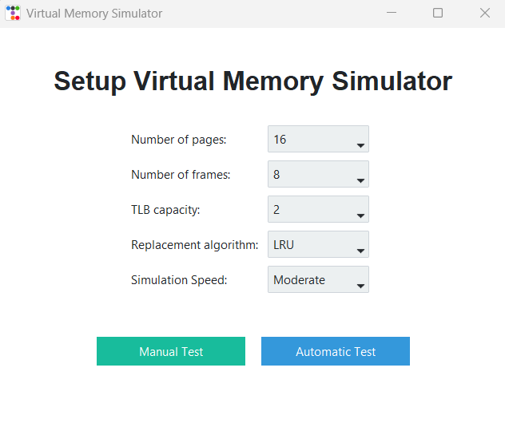
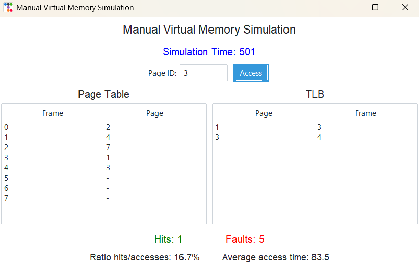
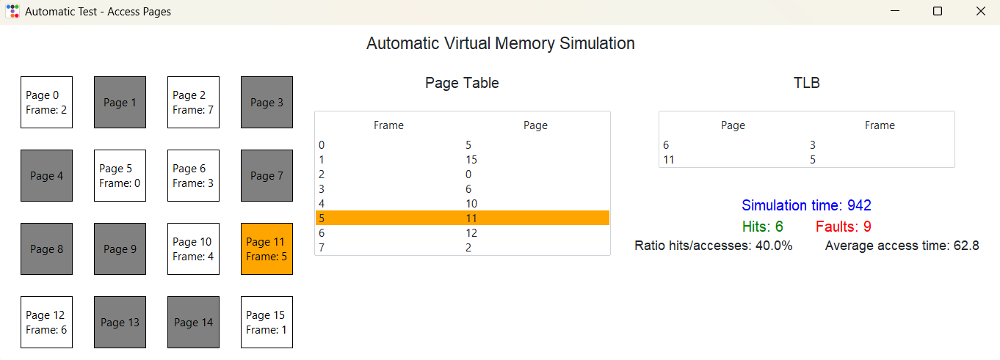

# Virtual Memory Simulator

A desktop virtual memory simulation built with Python and Tkinter/ttkbootstrap. Models how an OS manages memory pages, frames, a TLB, and a page table — supporting both manual and automatic simulation modes with real-time visual feedback.

## Features

- Configure number of pages, frames, TLB capacity, and replacement algorithm before starting
- **Manual mode** — access pages one at a time by ID and observe the result step by step
- **Automatic mode** — simulation runs automatically at a chosen speed (Slow / Moderate / Fast), randomly accessing pages
- Real-time visualization of page states (TLB hit, page table hit, page fault, eviction)
- Live **Page Table** and **TLB** tables with color-coded row highlights per event
- Statistics tracked per simulation: hits, faults, hit/access ratio, average access time
- Supports two page replacement algorithms: **LRU** and **FIFO**

## Tech Stack

- **Language:** Python 3
- **GUI:** Tkinter + ttkbootstrap
- **Architecture:** MVC

## How It Works

Each memory access goes through 3 levels:

1. **TLB lookup** — fastest path, costs 1 time unit (TLB hit)
2. **Page Table lookup** — costs 10 time units (page table hit)
3. **Page Fault** — page not in memory, costs 100 time units; triggers a frame allocation or page replacement

## Algorithms

- **LRU (Least Recently Used)** — evicts the page with the oldest last access time
- **FIFO (First In First Out)** — evicts the page that was loaded first

## Architecture

```
Controller.py         # Links GUI to business logic
business/
    MMU.py            # Memory Management Unit — core access logic
    PageTable.py      # Maps (pid, page_id) → frame_id
    TLB.py            # LRU-evicting translation lookaside buffer
    Algorithms.py     # LRU and FIFO replacement policies
models/
    Process.py        # Process with a list of Pages
    Page.py           # Page with access/load time tracking
    Frame.py          # Physical memory frame
view/
    GUI.py            # Main menu and simulation setup
    ManualWindow.py   # Manual page access UI
    AutomaticWindow.py# Automatic simulation UI
```

## Screenshots

### Setup


### Manual Mode


### Automatic Mode


## Getting Started

### Prerequisites

- Python 3.10+
- Install dependencies:

```bash
pip install -r requirements.txt
```

### Run

```bash
python GUI.py
```

## Design Patterns Used

- **Strategy Pattern** — `LRU` and `FIFO` both implement `ReplacementPolicy`, swapped at runtime
- **MVC Pattern** — `Controller` separates GUI from simulation logic
- **Observer-like** — `on_page_access` callback allows the MMU to notify the GUI on each access

## Documentation

A full project documentation is available in [`Documentation.pdf`](Documentation.pdf).
